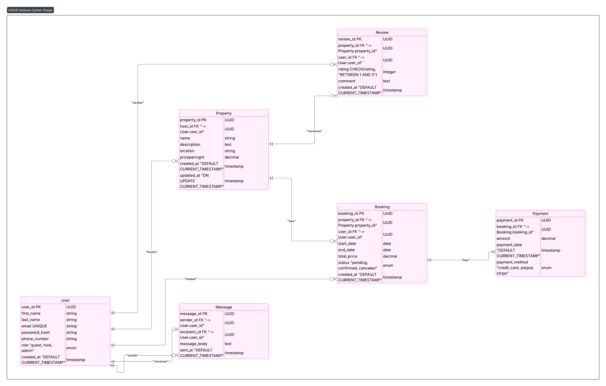

# Requirements – AirBnB Database System

## 1. Objective
Design and implement a relational database schema for an AirBnB-like application that allows users to list properties, make bookings, process payments, write reviews, and exchange messages.  
The database must be normalized up to Third Normal Form (3NF) to ensure data integrity and minimize redundancy.

---

## 2. Scope
The database will support the following core operations:
- User registration and authentication
- Property listing by hosts
- Property browsing and booking by guests
- Payment processing
- Review and rating system
- Messaging system between users
- Administrative roles for system oversight

---

## 3. Entities and Attributes

### User
- `user_id` (PK, UUID, Indexed)
- `first_name` (VARCHAR, NOT NULL)
- `last_name` (VARCHAR, NOT NULL)
- `email` (VARCHAR, UNIQUE, NOT NULL)
- `password_hash` (VARCHAR, NOT NULL)
- `phone_number` (VARCHAR, NULL)
- `role` (ENUM: guest, host, admin, NOT NULL)
- `created_at` (TIMESTAMP, DEFAULT CURRENT_TIMESTAMP)

### Property
- `property_id` (PK, UUID, Indexed)
- `host_id` (FK → User.user_id)
- `name` (VARCHAR, NOT NULL)
- `description` (TEXT, NOT NULL)
- `location` (VARCHAR, NOT NULL)
- `pricepernight` (DECIMAL, NOT NULL)
- `created_at` (TIMESTAMP, DEFAULT CURRENT_TIMESTAMP)
- `updated_at` (TIMESTAMP, ON UPDATE CURRENT_TIMESTAMP)

### Booking
- `booking_id` (PK, UUID, Indexed)
- `property_id` (FK → Property.property_id)
- `user_id` (FK → User.user_id)
- `start_date` (DATE, NOT NULL)
- `end_date` (DATE, NOT NULL)
- `total_price` (DECIMAL, NOT NULL)
- `status` (ENUM: pending, confirmed, canceled, NOT NULL)
- `created_at` (TIMESTAMP, DEFAULT CURRENT_TIMESTAMP)

### Payment
- `payment_id` (PK, UUID, Indexed)
- `booking_id` (FK → Booking.booking_id)
- `amount` (DECIMAL, NOT NULL)
- `payment_date` (TIMESTAMP, DEFAULT CURRENT_TIMESTAMP)
- `payment_method` (ENUM: credit_card, paypal, stripe, NOT NULL)

### Review
- `review_id` (PK, UUID, Indexed)
- `property_id` (FK → Property.property_id)
- `user_id` (FK → User.user_id)
- `rating` (INTEGER, CHECK: rating BETWEEN 1 AND 5, NOT NULL)
- `comment` (TEXT, NOT NULL)
- `created_at` (TIMESTAMP, DEFAULT CURRENT_TIMESTAMP)

### Message
- `message_id` (PK, UUID, Indexed)
- `sender_id` (FK → User.user_id)
- `recipient_id` (FK → User.user_id)
- `message_body` (TEXT, NOT NULL)
- `sent_at` (TIMESTAMP, DEFAULT CURRENT_TIMESTAMP)

---

## 4. Relationships
- A **User** can host many **Properties**.
- A **User** (guest) can make many **Bookings**.
- A **Property** can have many **Bookings**.
- A **Booking** must have exactly one **Payment**.
- A **User** can write many **Reviews**.
- A **Property** can receive many **Reviews**.
- A **User** can send and receive many **Messages**.

---

## 5. Functional Requirements
1. Users can register and log in with unique emails.
2. Hosts can list properties with details (name, description, location, price per night).
3. Guests can search properties and make bookings.
4. Guests can cancel bookings before start date.
5. Payments must be linked to bookings and securely recorded.
6. Guests can leave reviews and ratings for properties they booked.
7. Users can send private messages to each other.
8. Admins can manage users, properties, and bookings.

---

## 6. Non-Functional Requirements
- **Scalability**: Must handle thousands of users and bookings.
- **Security**: Passwords stored as hashes, payments processed securely.
- **Availability**: Database should minimize downtime.
- **Performance**: Queries (e.g., property search) should return results quickly.
- **Data Integrity**: Enforce constraints (PK, FK, UNIQUE, CHECK) to ensure consistency.

---

## 7. Database Constraints
- UUIDs used for all primary keys for uniqueness.
- Foreign keys enforce referential integrity.
- ENUMs restrict roles, booking status, and payment methods.
- CHECK constraint ensures review ratings are between 1–5.
- Timestamps track creation and updates.

---

## 8. Normalization
- The schema has been normalized up to **Third Normal Form (3NF)**:
  - No repeating groups (1NF).
  - No partial dependencies (2NF).
  - No transitive dependencies (3NF).
- Optional: `total_price` in `Booking` can be computed dynamically instead of stored.

---

## Entity-Relationship Diagram (ERD)

## ✅ Final Notes
This database schema supports the core features of an AirBnB-like system, is normalized to 3NF, and enforces data integrity through constraints and relationships.
